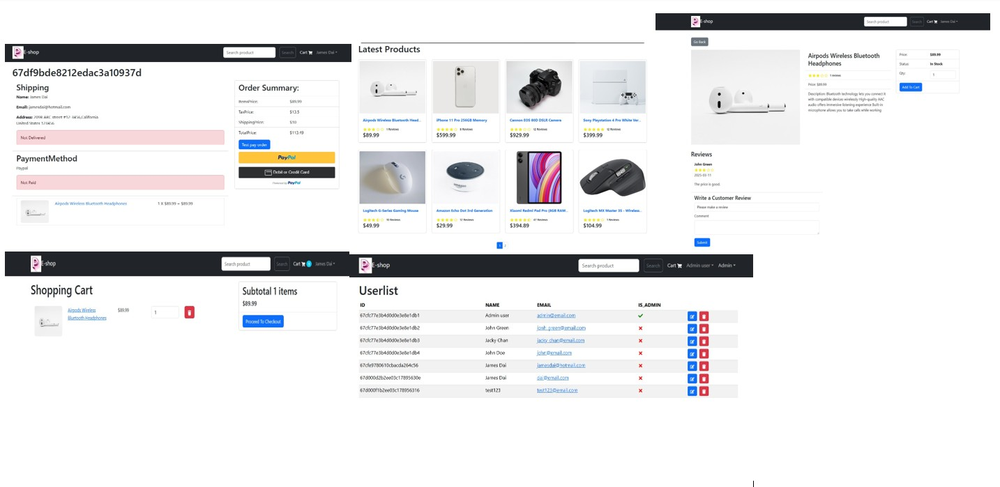

# MERN STACK Project

=======================================================================================================

## Project Introduction

This name of the project is E-platform, which is a fullstack web application
built using the MERN (MongoDB, Express, React,Nodejs).
It is a project that using the MERN stack(& Reduxtoolkits) to build a simple e-commerce platform.

## Technologies applied

The technologies applied in this project are:

- ⠀⠀MERN (MongoDB,Express,NodeJs,React)
- ⠀⠀Redux toolkits Query
- ⠀⠀React-BootStrap

## Features

&nbsp;Login / Registration / Logout

&nbsp;ProductsList / ProductDetails

&nbsp;User Profile/Users managment

&nbsp;Full Cart functions

&nbsp;Top products carousel

&nbsp;Payment with Paypal

&nbsp;Product search

&nbsp;Products pagination

&nbsp;Admin user management

&nbsp;Admin product management

&nbsp;Admin order management

&nbsp;Product reviews and rating

&nbsp;Checkout process (shipping, payment method, etc)

&nbsp;Database seeding

&nbsp;Web hosting

## Project Link

&nbsp;Project is hosted on Render. You can visit it here: [E-Platform on Render](https://e-shop-single-service.onrender.com/)

## What I have learnt

  &nbsp; React state management

  &nbsp; React & Reduxtoolkit / Query state management

  &nbsp; Database seeding

  &nbsp; Data model design

  &nbsp; MVC Model enhance

  &nbsp; Integration of frontend and backend

  &nbsp; Authorization and Authentication

## Future development

- Add more payment methods(currently only support paypal and credit card)
- Add product sorting by category
- Add the user password recovery
- Add the product filtering by price
- Add the status update of delivery(on the way,delivered...)
